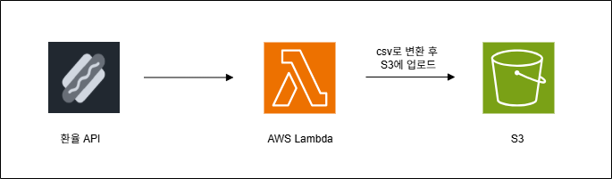
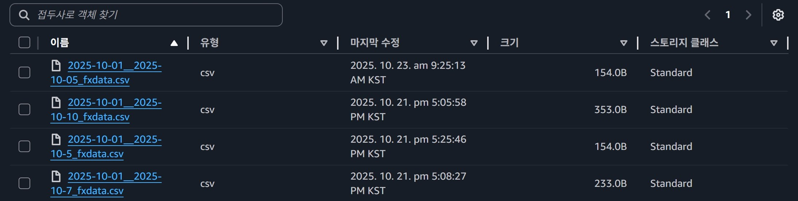

# AWS Lambda를 이용한 데이터 수집 파이프라인 구축


### 🧱 아키텍처 구성도



### 📘 프로젝트 개요
무료 오픈소스 환율 데이터 API **Frankfurter**에서 환율 정보를 **AWS Lambda** 함수를 통해 
데이터를 불러와 **CSV 파일로 가공**하여 **Amazon S3**에 업로드하는 파이프라인을 구현합니다.


### ⚙️ Lambda 함수 배포 가이드
```bash
# 1. 로컬에 작업용 폴더 만들기
mkdir lambda_deploy
cd lambda_deploy

# 2. 로컬에 pip 설치 경로 지정하여 설치
# requests 패키지를 현재 디렉터리에 직접 설치하라는 명령어
pip install requests -t .

# 3. ZIP 파일로 압축
python -m zipfile -c ..\lambda_deploy.zip .
```

#### 📂 Repository Structure
- lambda_function.py 파일을 만들고 requests 패키지를 현재 디렉터리에 직접 설치하라는 명령어를 입력하면 lambda_deploy폴더 구성은 다음과같다. 
```bash
lambda_deploy/
├── lambda_function.py      # Lambda 실행 코드
├── requests/               # requests 패키지 폴더
└── ...                     # 기타 의존 패키지(certifi, urllib3 등)
```
- 그러고 나서 ZIP 파일로 압축하여 Lambda 함수 → “코드” 탭 → “에서 업로드” 을 통해 코드와 필요한 패키지를 업로드한다.

#### ⚙️ Lambda 기본설정
1. Slack Webhook URL, API_KEY 같은 경우 AWS Lambda -> 구성 -> 환경변수에서 설정하면 된다.
2. AWS Lambda -> 구성 -> 일반 구성에서 제한 시간을 늘린다.

#### 📦 S3 업로드 결과

